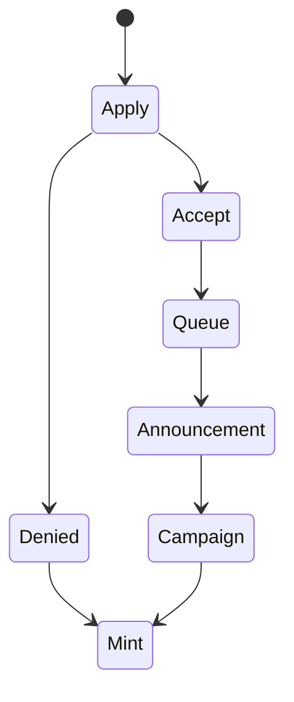

# Nebula
Nebula is an ecosystem built on injective with the primary goal of making NFTs more accesible. We're building a marketplace, launchpad, and more. Learn more [here](https://nebula-infrastructure.gitbook.io/untitled/)

### I want to mint on the platform, how do I?
Minting on our platform is completely open using our candy machine. However, if you'd like to go through our launchpad program, you can apply [here](
https://forms.gle/Km1goCZ6w6nMRSwX6). 

